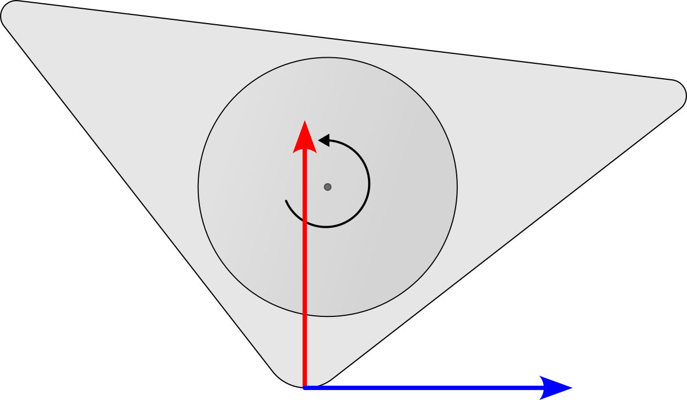
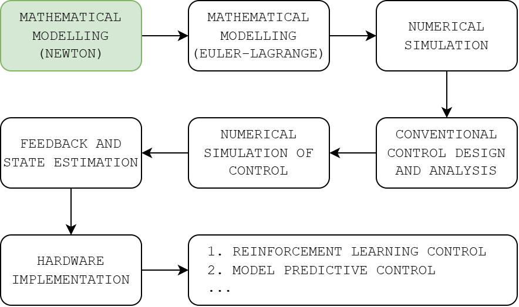

# trical

   

Design and implementation of control systems for a Triangle Balance Robot in the [dc&e](https://github.com/risherlock/dc-e) club. The goal is to first start with conventional full-state feedback control and then experiment with different control approaches, such as RL and MPC, while making the most out of control and estimation theory in the process.

## Progress

Imitation Learning for RWP using dataset from NMPC generated trajectories
https://github.com/user-attachments/assets/71986538-07d0-4e2b-8f98-61594346f25b

   

## Team

1. Himanshu Paudel

## References

1. Fantoni, Lozano - Non-linear Control for Underactuated Mechanical Systems (2002)
2. Block, Åström, Spong - The Reaction Wheel Pendulum (2007)
